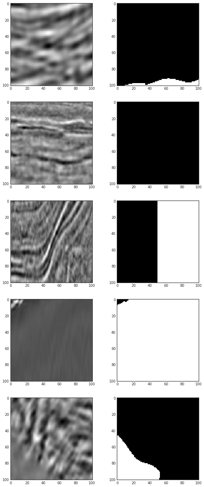
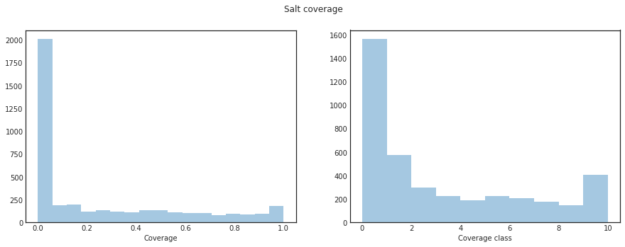
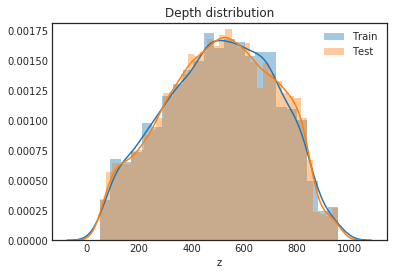
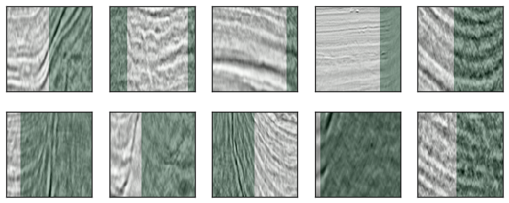
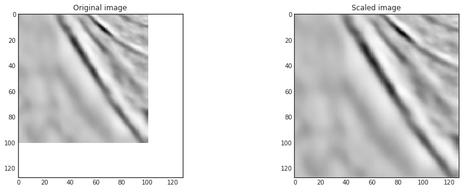
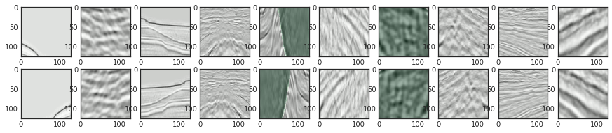
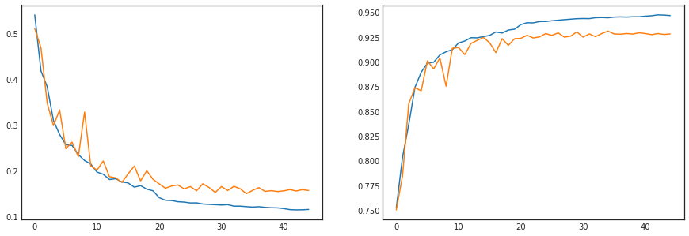
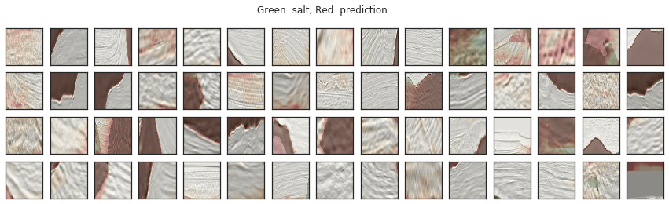
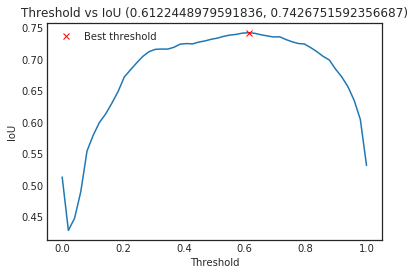
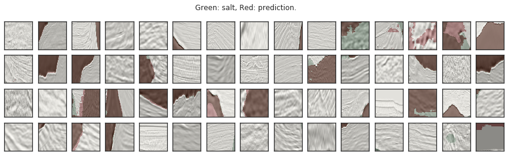

# Machine Learning Engineer Nanodegree
## Capstone Project
Shane Moloney
August 20th, 2018

## I. Definition

### Project Overview

I found this project on Kaggle, the domain is underground probing by seismic imaging and the processing of the resulting images to find salt deposits. Areas of Earth with large quantities of oil and gas also contain large deposits of salt, detecting these in the seismic images currently requires experts to manually analyse all the images. This can be very subjective, with varying conclusions, making it very difficult to find the exact position of the deposits. Drilling an incorrect position can cost huge amounts in wasted funds and worst of all, can result in dangerous work conditions for the drilling crew. TGS is hoping to use machine learning to find the deposits accurately and have provided a large dataset of thousands of image samples and masks containing the salt deposit locations. The competition and further details can be found on the [TGS Salt Identification](https://www.kaggle.com/c/tgs-salt-identification-challenge) competition page.

The dataset consists of greyscale images of seismic imaging data, there are 4000 images provided for training and 18000 used for testing. A few examples of the images can be seen below:  
![ex0] ![ex1] ![ex2] ![ex3]

[ex0]: pictures/example_0.png
[ex1]: pictures/example_1.png
[ex2]: pictures/example_2.png
[ex3]: pictures/example_3.png

As you can see there are two types of material in the images. Sediment, which appears in layers and horizontal stripes in the images, and salt, which is flat or more chaotic in its structure in the images.

### Problem Statement

The problem is to identify the pixels that contain salt and produce a mask of the image in which the pixel values range from 0 to 1 and these values represent the probability of that pixel containing salt. This is a problem that is perfect for a CNN, or specifically a Unet model CNN. The Unet model is very effective at segmentation tasks and is known for it's work on the [Biomedical Image Segmentation](https://lmb.informatik.uni-freiburg.de/people/ronneber/u-net/) problem. The basis of this model is to reduce the layer size exponentially and similarly increase the channel count until the layer size reaches some minimum, ie. 32x32, and then to use Conv2DTranspose layers to exponentially increase the layer sizes and reduce the channel count to the original size. This allows for fast, accurate image segmentation and has been used for many industries and areas of study. A diagram of the Unet architecture that was used for the Biomedical Image Segmentation problem can be seen below:


This method should do relatively well without any additional methods being used as this is a segmentation problem. There are many ways we can improve the Unets results and the effectiveness of its training such as data augmentation, dropout layers for network exploration, etc.

### Metrics
The evaluation for this challenge is done using the mean average precision at different intersection over union thresholds. This is done by first getting the prediction image A and the ground truth image B and calculating their intersection over their union:  

$$IoU(A, B) = \frac{A \bigcap B}{A \bigcup B}$$

The IoU is calculated based on a threshold, ie. if the threshold is 0.5 the IoU has to be over 0.5 to be considered a hit. The thresholds in this case range from 0.5 to 0.95 with a step size of 0.05. For each threshold, $t$, we calculate a precision value using the number of true positives (TP), false negatives (FN) and false positives (FP). These are gathered when comparing the values of the prediction and the ground truth:

$$\frac{TP_t}{TP_t + FP_t + FN_t}$$

The average precision value for a single image is calculated by the mean of the precision values for each IoU threshold calculated above, so the equation looks like this:

$$\frac{1}{thresholds}\sum_t\frac{TP_t}{TP_t + FP_t + FN_t}$$

Finally the models score is the mean of all the average precision values of all the images in the test set.  


## II. Analysis
_(approx. 2-4 pages)_

### Data Exploration

I explored the data quite thoroughly in the notebook, but before I even began properly analysing the data I found some interesting outliers. After I imported the data I simply displayed the first five images and their matching masks. These images can be seen below:


The issue should stand out immediately, the third images mask is a perfectly straight border down the center of the image, I think this is problematic as we want to train the model to accurately find the borders between salt and sediment and I will explore this more in the Data Preprocessing section below.  

Next I began looking at the entire data by inspecting the coverage of the salt in each image, or rather the percentage, between 0 and 1, of the image that contains salt. This was calculated by simply by the following method:  

$$ cov = \frac{\sum_i pix}{w*h} $$

Now this is a continuous value which makes it difficult to group or categorise images in this space so I created the coverage class column where I apply a ceiling rounding policy to the discretisation. When we plot these two columns from the data on a distribution plot we get the following:  



Now we can see that approximately half the data set consists of images with very little or no salt coverage. This is good as our model needs to learn how to identify images with no salt as well as images with it. There is another aspect to the data I hadn't mentioned yet, depth, the data was accompanied with a CSV file containing the depths at which each scan was taken, this is important to us as different depths would likely result in different sediment and salt formations. Let's have a look at the distribution of the depths sampled from both the training and testing sets:  



This looks like a nice gaussian distribution meaning we have a nice random sampling of depths which is good for our training and gives us more confidence in our ability to avoid overfitting to a specific data set.

### Algorithms and Techniques

As explained above, I used the Unet model CNN for the main algorithm as well as some data augmentation. A CNN is a form of neural network that makes use of Convolutional Layers to process images. These networks consist of three primary types of layers, Convolutional, Pooling and ending with a Fully Connected layer. I'll explain the former two of these layers functions and why they are needed for the task of image feature detection, I won't be talking about the Fully Connected layers as these are not used in the Unet structure since instead of a single or small number of probability outputs for different it produces a mask of the same size as the original input.

#### Convolutional Layers
These layers use a kernel to process the image, otherwise known as the filter, the size of which defined by a width and height in pixels, eg ```(3x3)```. Inside the CNN this translates to a 3x3 grid where each cell in the grid has its own weight, when the kernel is placed over a pixel, the center cell being the anchor point, the dot product between the kernel cells and the relevant pixels is calculated and summed to get the weight of the corresponding pixel in the result. The diagram below shows this process:


[Source](https://stats.stackexchange.com/questions/239076/about-cnn-kernels-and-scale-rotation-invariance)

The kernel then slides over the image, or "convolve" over them, in strides meaning the number of pixels the kernel moves over between each application of the weights and producing values for the output map or activation map. It is called this as over the course of the training the kernels weights will adjust and each will learn to recognise different features and will produce higher values on their outputs where these features are present, these high value regions are known as activations. The early kernels usually learn to find simply features such as various types of edges and corners, later kernels might learn combinations of these features such as circles and squares, followed by kernels that activate around high level features like eyes, hands, etc. The final few kernels will then recognise entities such as faces, cars, animals, etc. The final product from the Convolutional layer is an array of these activation maps stacked together along the depth axis.  

This functions by having the neurons in the convolutional layer connect to the output of a single application of the kernel to the input, this translates to a neuron having $3x3x1 = 9$ connections to the input. Meaning each neuron represents one application of one kernel to the input, so if we are applying the kernel to the input 10 times and we have 10 kernels we will have a convolutional layer with 100 nodes, each with 9 connections to the input meaning 900 connections in our first layer. This follows with an activation layer using ReLu as pixel values cannot be negative but we want to retain the full range of positive values. Which then leads into another convolutional - ReLu pair that processes the activation maps from the previous layer in the same way to find more features and analyse the image further, we now run into an issue though, these layers create huge amounts of connections, as in hundreds of millions. The solution to this is the Pooling layer.

#### Pooling Layers

These are layers used to reduce the width and height of the activation maps, therefore reducing the amount of parameters and calculations within the network, this also assists in overtraining prevention. The depth of the maps are retained as a pooling layer works by a similar basis as a convolutional layer but instead of the kernel overlapping in its calculations the pooling layer reduces the sample of the map the kernel is on to just one pixel. The most common use of pooling layers are Max Pooling with a kernel of 2x2 and a stride of 2, what this means is the kernel simply returns the max of all 4 values and the rest are discarded, a visual of this can be seen in the figure below:


[Source](http://cs231n.github.io/convolutional-networks/)

This reduces the map size by a factor of two, discarding 75% of the activations but focusing the highest values ones and retaining the depth of the features.

#### Other Techniques

For preprocessing I removed some outliers that I will explain further below. I made use of early stopping, model checkpointing and learning rate reduction when training my model.
- Early stopping: sets a maximum number of epochs where the validation loss does not improve and once that limit is reached the training endless
- Model checkpointing: this simply saves the best version of the model, so when the validation loss improves the current weights are saved to a file to be retrieved after the training, by the end of the training the file will contain the best models weights
- Learning rate reduction: when the improvement rate of the model begins to slow, ie the validation loss stops improving, we reduce the learning rate to make the changes in the weights less drastic and so zeros in on the ideal weights faster  

These were all used in conjunction with a high number of epochs and batches.

### Benchmark

While there is no benchmark model provided, a group has created an open source project for this competition to be used as a benchmark or as baseline code to be used as a space for experimentation or just to be used as a starting off point. The project is being run by a group called neptune.ml and can be found on their site [here](https://app.neptune.ml/neptune-ml/Salt-Detection?namedFilterId=about). I think this will make a good benchmark as it implements a Unet as well and is not like other baseline code examples out there as the goal for the project is to use an open source platform to work on the challenge together so it does not stop at the most basic implementation and uses augmentation and other methods to improve the score.

As is stated on their site, their first attempted solution scored 0.745, which is to be expected of a solution developed by a community of people interested or working in machine learning. I would be very impressed if my solution is able to beat this as the top scores are just over 0.85 meaning there is only about a ten percent difference between the scores and to bridge that gap would presumably require advanced, high level machine learning knowledge.

## III. Methodology

### Data Preprocessing

There were three main parts to the data preprocessing: outlier removal, resizing and augmentation.

#### Outlier Removal
As we saw earlier there are some outliers where the masks have a straight border between salt and sediment, this made me very suspicious so I decided to inspect the entries with straight borders. I used OpenCV to edge detect the masks and then rotated the image sideways, this allowed me to simply iterate through the rows and find if there is a row where all pixels were white. I applied this method to all the masks and added the index of any straight bordered masks to an array.  

```py
def has_straight_border(mask_id, shape, edge_array):
    mask = cv2.imread('../input/train/masks/{}.png'.format(mask_id))
    edges = cv2.Canny(mask, 100, 200)
    mat = cv2.getRotationMatrix2D((shape[0]/2,shape[1]/2),90,1)
    edges_rotated = cv2.warpAffine(edges, mat, shape)
    edge_array.append(edges_rotated)
    for row in edges_rotated:
        if all(pix == 255 for pix in row):
            return True
    return False
```

There are 117 straight edged masks, I displayed all of these masks as green overlays on their corresponding images to see what the cause might be, a sample of these can be seen in the figure below:



These borders are clearly not particularly accurate and seem to be broad stroke feature identification. These need to be removed to prevent using too many false positives and false negatives when training the model but There are some that have a large salt coverage and we don't want to lose that data. So I filtered the array based on the coverage class, only keeping the images with a class of 8 or higher, this resulted in the removal of 75 data points. We now have a dataset with shape ```(3925, 5)```.

#### Resizing

The Unet model, as explained earlier, exponentially decreases the size of the convolutional layers, this means our inputs must have dimensions that are a power of 2. So I created a function to upscale the images, ```upsample```, from their size of 101x101 to 128x128 and vice versa, ```downsample```. I then used these functions when creating the training, testing and validation sets:

```py
train_test_split(
    train_idx,
    np.array(train_full.images.map(upsample).tolist()).reshape(-1, new_size, new_size, 1),
    np.array(train_full.masks.map(upsample).tolist()).reshape(-1, new_size, new_size, 1),
    train_full.coverage.values,
    train_full.z.values,
    test_size=0.2, stratify=train_full.coverage_class, random_state=117)
```

I also used the coverage class attribute of the data as a stratification criterion to ensure an even spread of the different types of images. The outputs from this function is a training and test set for the  The data sets now contained upscaled versions of the images and masks:



#### Data Augmentation

Finally I augmented the data by simply flipping the x-axis on each of the images and masks, this is because with a data set such as this, where all of the segmentation subjects are naturally occurring phenomena there will be no two images that are exactly the same. This means that flipping the images essentially doubles our data for training and testing. This was done with a simple line of code:

```py
train_x = np.append(train_x, [np.fliplr(img) for img in train_x], axis=0)
train_y = np.append(train_y, [np.fliplr(img) for img in train_y], axis=0)
```


### Implementation

The model itself I placed inside a function so I could easily edit the parameters and experiment with different values. The function takes in the input layer and the number of channels to begin with, again this should be a power of two. I also set up variables within the function for dropout, kernel and stride:

```py
def build_model(input_layer, base_channels):
    dropout = 0.25
    kernel = (3, 3)
    stride = (2, 2)
    # Image size: 128 to 64
    conv1 = Conv2D(base_channels, kernel, activation="relu", padding="same")(input_layer)
    conv1 = Conv2D(base_channels, kernel, activation="relu", padding="same")(conv1)
    pool1 = MaxPooling2D((2, 2))(conv1)
    pool1 = Dropout(dropout)(pool1)

    # Image size: 64 to 32
    conv2 = Conv2D(base_channels * 2, kernel, activation="relu", padding="same")(pool1)
    conv2 = Conv2D(base_channels * 2, kernel, activation="relu", padding="same")(conv2)
    pool2 = MaxPooling2D((2, 2))(conv2)
    pool2 = Dropout(dropout*2)(pool2)

    # Image size: 32 to 16
    conv3 = Conv2D(base_channels * 4, kernel, activation="relu", padding="same")(pool2)
    conv3 = Conv2D(base_channels * 4, kernel, activation="relu", padding="same")(conv3)
    pool3 = MaxPooling2D((2, 2))(conv3)
    pool3 = Dropout(dropout*2)(pool3)

    # Image size: 16 to 8
    conv4 = Conv2D(base_channels * 8, kernel, activation="relu", padding="same")(pool3)
    conv4 = Conv2D(base_channels * 8, kernel, activation="relu", padding="same")(conv4)
    pool4 = MaxPooling2D((2, 2))(conv4)
    pool4 = Dropout(dropout*2)(pool4)

    # Midway point
    conv_mid = Conv2D(base_channels * 16, kernel, activation="relu", padding="same")(pool4)
    conv_mid = Conv2D(base_channels * 16, kernel, activation="relu", padding="same")(conv_mid)

    # Now we mirror the above layers and begin increasing the image size using Conv2DTranspose layers
    # Image size: 8 to 16
    trans_conv4 = Conv2DTranspose(base_channels * 8, kernel, strides=stride, padding="same")(conv_mid)
    uconv4 = concatenate([trans_conv4, conv4])
    uconv4 = Dropout(dropout * 2)(uconv4)
    uconv4 = Conv2D(base_channels * 8, kernel, activation="relu", padding="same")(uconv4)
    uconv4 = Conv2D(base_channels * 8, kernel, activation="relu", padding="same")(uconv4)

    # Image size: 16 to 32
    trans_conv3 = Conv2DTranspose(base_channels * 4, kernel, strides=stride, padding="same")(uconv4)
    uconv3 = concatenate([trans_conv3, conv3])
    uconv3 = Dropout(dropout * 2)(uconv3)
    uconv3 = Conv2D(base_channels * 4, kernel, activation="relu", padding="same")(uconv3)
    uconv3 = Conv2D(base_channels * 4, kernel, activation="relu", padding="same")(uconv3)

    # Image size: 32 to 64
    trans_conv2 = Conv2DTranspose(base_channels * 2, kernel, strides=stride, padding="same")(uconv3)
    uconv2 = concatenate([trans_conv2, conv2])
    uconv2 = Dropout(dropout * 2)(uconv2)
    uconv2 = Conv2D(base_channels * 2, kernel, activation="relu", padding="same")(uconv2)
    uconv2 = Conv2D(base_channels * 2, kernel, activation="relu", padding="same")(uconv2)

    # Image size: 64 to 128
    trans_conv1 = Conv2DTranspose(base_channels, kernel, strides=stride, padding="same")(uconv2)
    uconv1 = concatenate([trans_conv1, conv1])
    uconv1 = Dropout(dropout)(uconv1)
    uconv1 = Conv2D(base_channels, kernel, activation="relu", padding="same")(uconv1)
    uconv1 = Conv2D(base_channels, kernel, activation="relu", padding="same")(uconv1)

    output_layer = Conv2D(1, (1, 1), padding="same", activation="sigmoid")(uconv1)

    return output_layer
```

### Refinement

Above is the final version of the function, but I spent a lot of time experimenting with different values for the various parameters, especially ```dropout``` and ```base_channels``` to try and find the ideal combination. Originally I used just the base Unet model with no dropout and only starting with 2 channels, as I understood more about how the model functions I added the dropout layers, refined their use to what you see above of increasing dropout in the inner layers and decreasing in the first and final layers. This exploration helped immensely as the Unet model reaches a very large amount of channels and so can easily end up ignoring some due to early weight imbalances.  

I also tried different optimizers and loss parameters, but the hardest variables to experiment with were the early stopping and learning rate reduction thresholds as these had a drastic effect on training time and were the most time consuming to refine.

## IV. Results
_(approx. 2-3 pages)_

### Model Evaluation and Validation

The first thing I did after running my model was plot the validation and training loss against one another as well as the accuracy, it was very apparent where the ideal model lay in each training due to the separation of the two scores as the model began to overfit to the training data:



The next thing I did was do a sanity check using the validation set, I predicted the set and displayed them on top of the images and masks as seen previously, where grey is the original image, green is the ground truth and red is the prediction. The red varies in severity as the model produces probabilities so the lighter the red the less likely the model considers that pixel to be salt.



The model did very well in a majority of the images, you can see it produced a clear border between the salt and the sediment and was very sure of the salt pattern inside the borders. It also sometimes seems to try hard to find salt where there isn't any, on a few images we can see the model has placed low probabilities throughout when there is no salt, while on other zero coverage images it is sure that there is no salt. The model also seems to struggle if there are multiple borders in the one image, ie if there is a layer of salt inlayed throughout the sediment as opposed to a single border split, the same applies vice versa as we can see that images with a column of sediment flanked either side by salt, the model predicts one but not both of the salt segments. This could be due to a lack of such images in the training data, or a the very least a minority of some such images.  

Next I ran the IoU metrics and used the thresholds provided by the competition. As defined in the metrics section of this report the IoU is calculated for each image and each threshold, the final score is the average of all these values. In our case we are going to look at a graph of the IoU score for each threshold:



The graph shows a wide curve where the low thresholds produces a low score due to the very low probability pixels being counted as salt predictions. The high thresholds also score lower as only pixels the model is very sure of are counted and so this leaves very little room for error. As we can see the model does best when the threshold is set to only count pixels as salt predictions with an IoU of ~0.4 -> ~0.7. The goal is to make this curve as tall and as wide as possible since the end metric is the average of all these scores.
In this run the best threshold was ~0.612, the model received an IoU score of ~0.743 at this threshold, but what does this mean? We can visualise the difference between the thresholded predictions and the unrestricted predictions by displaying the same images as above but with the prediction threshold set to the best performing one of ~0.612:



Here we can see that the edges become even more clear, any pixels with a probability value of less than the threshold are gone, this improves many predictions by removing the fuzzy edges and providing a more precise segmentation of the salt deposits. It can also worsen other predictions as we can see where the model was unsure but correct about a deposit that prediction has not been counted. All in all this threshold produces a much cleaner prediction and we can see the model performs very well with this threshold applied.  

Finally I run my predictions on the test set, this set is 18000 images and all the predictions must be run-length encoded for the submission file for the competition. This is a simple enough function that everybody in the competition needed so I use the one written by [bguberfain](https://www.kaggle.com/bguberfain/unet-with-depth). The file is submitted and I received a score of 0.716, which places me at 792nd out of 1375 entrants. I think my model did very well considering it was up against machine learning experts and experienced ML engineers from around the world, but also because I think even if a machine learning model was deployed in this industry it would still be necessary to have an expert double check positive predictions. Even my model seems to correctly predict the existence of the salt deposit quite well and seems like it might only struggle with small deposits.

### Justification

As stated above the benchmark model got a score of 0.745 and has continued to improve but I am using their first solutions score as it only seems fair given it is an open source project that is continuously going to improve. While my model scored 0.716, meaning there is a difference of only ~0.02 between my score and the benchmarks, I consider this to be a great result as a new member of the machine learning community. If I had more time I would like to continue to improve upon my method and find new techniques and algorithms to help refine both my model and my processes for coming up with it.


## V. Conclusion

### Reflection

I found the whole process very interesting, the exploration of the data involved a lot of experimentation and taught me a lot about both data exploration and provided some great pyplot experience. I learned a lot about seismic image segmentation, mostly I learned about it when searching for a benchmark model and read through a few academic articles which taught me a lot about sediment, and salt deposits. On top of that my research into CNNs and then into Unets was very interesting and really enhanced my knowledge of neural networks as a whole. I discovered Unets from the competitions community where I saw the titles of many kernels and submissions were "Unet with ...", this caused me to look up what a Unet was and how to use them, I could immediately see why they were a common solution attempt for competitors as they are designed for segmentation tasks.  

The most difficult part of the process I found was to be the refinement of and experimentation with the model training parameters just due to how long it takes to train and how many different parameters and variables are involved in tuning the model. Evaluating the model was very easy though as the metrics were so well defined and there were many different ways to examine the models performance. The thresholds graph provided a clear view of the general performance and allows us to easily see improvements or shortcomings of the model.  

The final solution definitely has room for improvement and if the goal was to simply find salt deposits as opposed to accurately mapping them I believe this model could be used but currently as the latter is the problem posed I don't believe my model could be used in this space. I learned a lot over the course of the project and am glad I could pursue such an interesting problem statement and explore a domain I had no previous experience or knowledge of.

### Improvement

I think my methods could definitely be improved, the outlier identification and removal could perhaps be handled better or be made more robust. I think there may be more I can do with the preprocessing of the data, such as incorporating the depth in some way, such as colouring the images based on their depth as it may be an important feature in a salt deposits identification. Of course there can always be more tweaking of the training parameters and the model itself to find the ideal set up. While I don't know of any other methods or techniques that could be used I am sure there are plenty out there that could vastly improve my model but I didn't have time to truly research anything that the course hadn't already mentioned or I wasn't already aware of in some capacity.  

If I were to use my solution as a new benchmark I think I could improve upon it, I know there are many better solutions due to the leaderboard on the competition page which likely make used of advanced ML techniques or combinations of methods that I never even considered.
